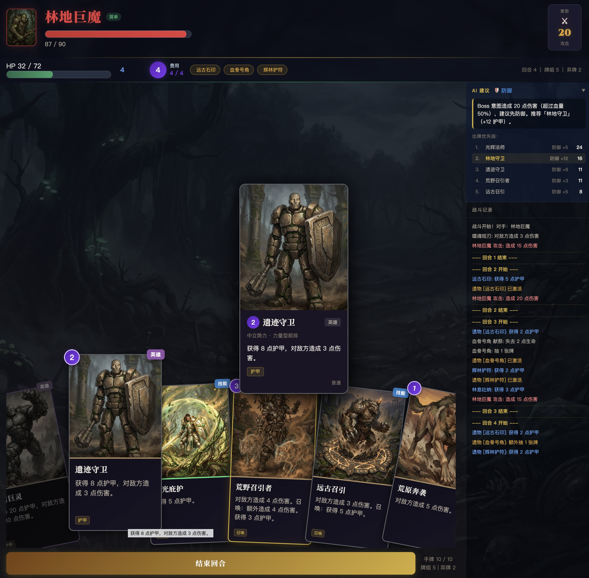

# 远古战场 — Dota 主题 Roguelike 卡牌战斗游戏

一个基于 Dota 世界观的单人 Roguelike 卡牌战斗原型，使用 React + TypeScript 构建。

**[在线试玩](https://dota-card-battle.ai-builders.space/)**



## 游戏特色

**20 张 AI 生成的卡牌**，覆盖天辉、夜魇、中立三大阵营，力量型前排、敏捷型连击、智力型法术三种流派。每张卡牌都有独立的高魔奇幻风格插画。

**3 种 Boss 挑战**：林地巨魔（简单）、暗影守卫（普通）、远古巨蛇（困难），每种 Boss 有独特的攻击模式和专属战场背景。

**即时结算战斗系统**：费用逐回合递增（1→2→3→4→5），出牌立即结算，护甲每回合清零。英雄牌提供高预算爆发，技能牌覆盖基础攻防，遗物牌提供持续被动增益。

**AI 策略建议**：内置 AI 顾问面板，实时分析战局并推荐最优出牌，帮助玩家理解攻防节奏。

## 快速开始

```bash
# 安装依赖
bun install

# 启动开发服务器
bun run dev

# 构建生产版本
bun run build

# 运行测试（73 个测试）
bun run test
```

打开 `http://localhost:5173` 即可开始游戏。

## 技术栈

- **框架**：React 19 + TypeScript
- **构建**：Vite
- **测试**：Vitest + Testing Library（73 个测试，覆盖战斗引擎、卡牌效果、AI 顾问、组件冒烟测试）
- **CI**：GitHub Actions（push 时自动 build + test）

## 项目结构

```
src/
├── engine/           # 战斗引擎（纯函数式状态变换）
│   ├── battleEngine.ts   # 状态机：回合流程、费用递增、胜负判定
│   ├── cardEffects.ts    # 卡牌效果结算：伤害/护甲/治疗/连击/召唤/献祭/沉默
│   ├── aiAdvisor.ts      # AI 策略建议引擎
│   └── types.ts          # TypeScript 类型定义
├── components/       # UI 组件
│   ├── BossSelect.tsx    # Boss 选择页
│   ├── BattleField.tsx   # 战斗主页面
│   ├── HandArea.tsx      # 扇形手牌区
│   ├── CardView.tsx      # 卡牌渲染（阵营色带、稀有度光效）
│   ├── CardPreview.tsx   # 卡牌详情预览浮层
│   ├── AiAdvisor.tsx     # AI 建议面板
│   └── ...
├── data/             # 游戏数据（JSON 驱动）
│   ├── card_designs.json # 20 张卡牌配表
│   └── boss_designs.json # 3 种 Boss 配表
└── __tests__/        # 测试
    ├── battleEngine.test.ts
    ├── cardEffects.test.ts
    ├── aiAdvisor.test.ts
    └── App.smoke.test.tsx
```

## 数据驱动设计

所有卡牌和 Boss 数据存储在 JSON 文件中，游戏逻辑在运行时读取。修改 JSON 即可调整卡牌数值、新增卡牌或 Boss，不需要改代码。配套的 Python 工具链（在父项目中）提供静态配表校验和蒙特卡洛战斗模拟。

## 背景

这个项目探索 AI 辅助游戏开发的完整工作流——从世界观设计、卡牌配表、AI 生成插画、蒙特卡洛平衡性验证到前端实现，全程使用 AI 协作完成。
